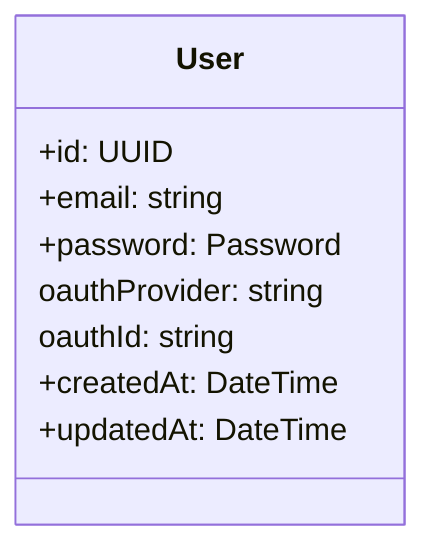
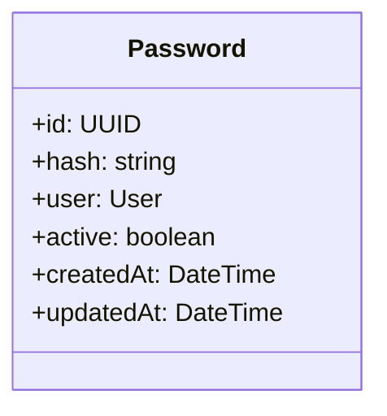
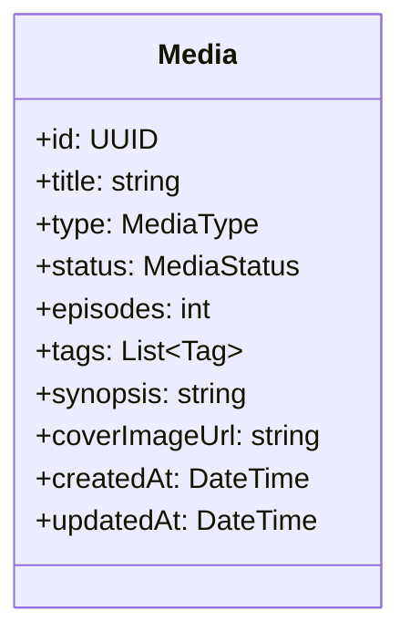
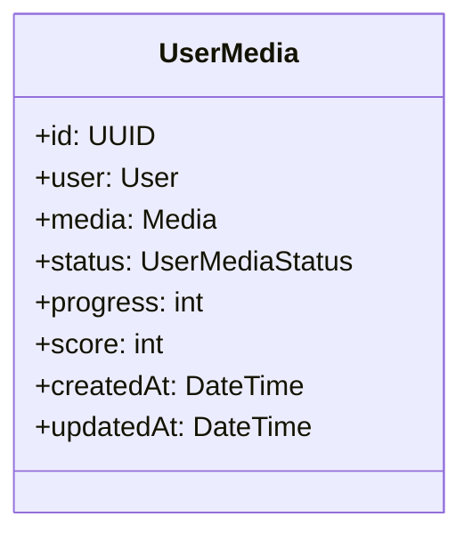
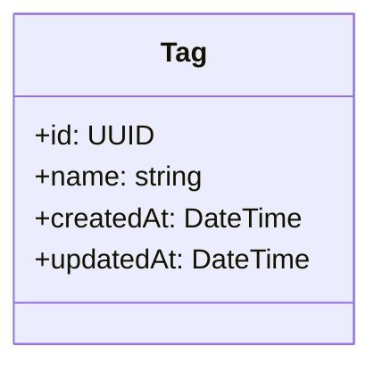
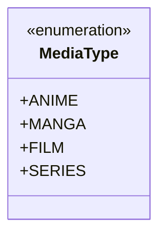
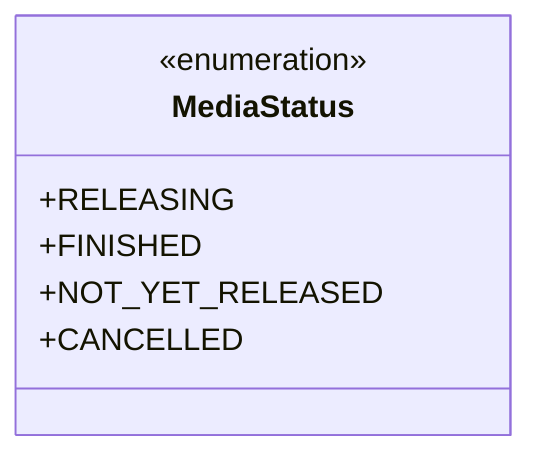
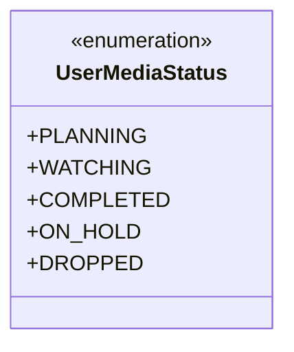
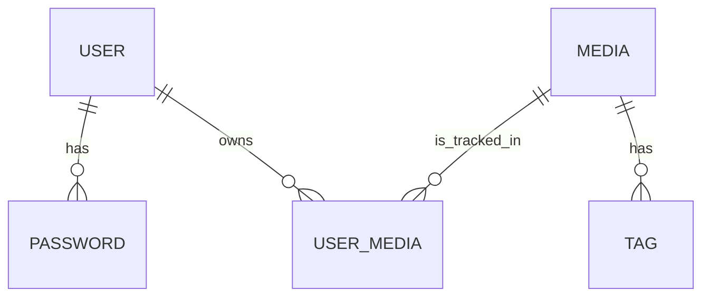

# NayaViewBack

## Descripción.

Este proyecto es una aplición API que maneja la apliacción. 

NayaView es una aplicación de tipo agenda/anotador de anime/manga que permite a los usuarios llevar un registro de las series que están viendo o leyendo, así como de su progreso y calificaciones. La aplicación ofrece una interfaz intuitiva y fácil de usar, permitiendo a los usuarios agregar nuevas series, actualizar su estado (por ejemplo, "viendo", "completado", "en pausa"), y calificar las series que han terminado. Además, NayaView proporciona recomendaciones personalizadas basadas en las preferencias del usuario y su historial de visualización/lectura. La aplicación también incluye funciones sociales, como la posibilidad de compartir listas con amigos y seguir a otros usuarios para descubrir nuevas series.

## Tecnologías Utilizadas
- Node.js
- NestJS
- TypeScript
- PostgreSQL
- Prisma ORM
- JWT para autenticación
- Docker para la contenedorización

## Modelo de datos

- User:

- Password:

- Media:

- UserMedia:

- Tags:

- MediaType Enum:

- MediaStatus Enum:

- UserMediaStatus Enum:

### Diagrama de Entidades y Relaciones (ERD)

